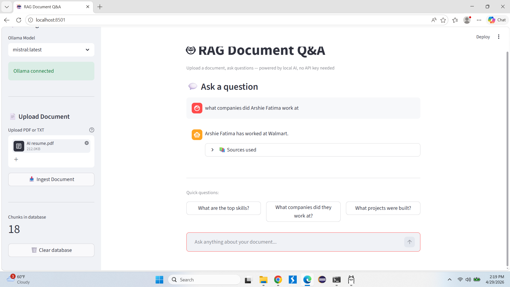
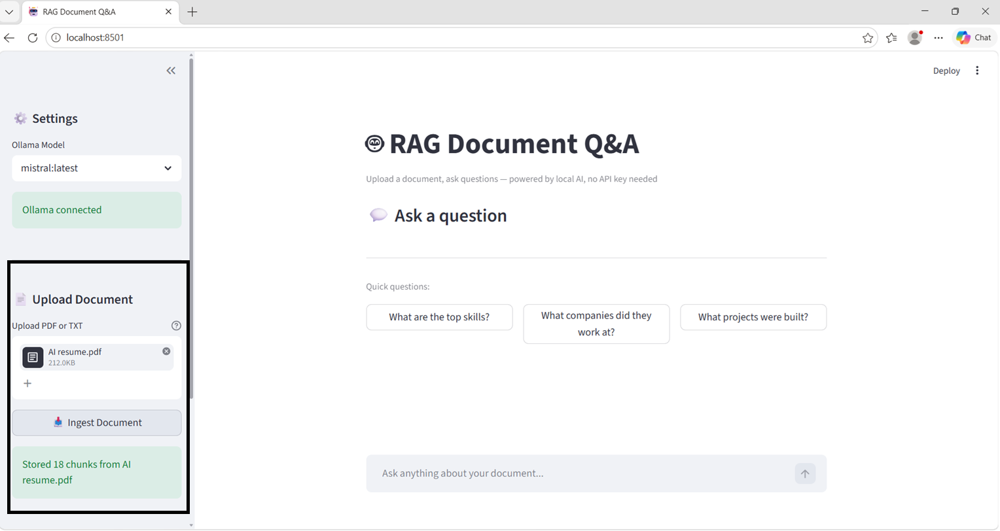

# 🤖 RAG Document Q&A System


> **Production-grade RAG (Retrieval-Augmented Generation) system** — upload any PDF or TXT document and ask AI-powered questions. Runs 100% locally with no API keys required, and deploys to the cloud via Streamlit.

## 🌐 Live Demo

**[➡️ Try it here: aws-rag-demo-y7opipexkimfykf9thrhbg.streamlit.app](https://aws-rag-demo-y7opipexkimfykf9thrhbg.streamlit.app/)**

---

## 📸 Screenshots

### Chat Interface
> *Upload a document, ask questions, get AI-powered answers with source citations*

<!-- Replace with your actual screenshot -->


### Document Upload & Ingestion
> *Drag and drop any PDF or TXT — automatically chunked, embedded and stored*

<!-- Replace with your actual screenshot -->


---

## 🏗️ Architecture

```
Your Document (PDF / TXT)
         │
         ▼
   ┌─────────────────┐
   │   Document      │  PyPDFLoader / TextLoader
   │   Loader        │
   └────────┬────────┘
            │
            ▼
   ┌─────────────────┐
   │   Text          │  RecursiveCharacterTextSplitter
   │   Chunker       │  500 tokens, 50 overlap
   └────────┬────────┘
            │
            ▼
   ┌─────────────────┐
   │   Embeddings    │  sentence-transformers
   │   Model         │  all-MiniLM-L6-v2 (FREE, local)
   └────────┬────────┘
            │
            ▼
   ┌─────────────────┐
   │   ChromaDB      │  Persistent vector store
   │   Vector Store  │  Cosine similarity search
   └────────┬────────┘
            │
   User Question ──► Embed ──► Similarity Search ──► Top-K Chunks
                                                           │
                                                           ▼
                                                   ┌──────────────┐
                                                   │  Ollama LLM  │  Mistral 7B
                                                   │  (local)     │  (FREE)
                                                   └──────┬───────┘
                                                          │
                                                          ▼
                                                       Answer ✓
```

---

## ✨ Features

- 📄 **Upload any PDF or TXT** — drag and drop in the browser
- 🧠 **100% free embeddings** — sentence-transformers runs locally, no API key
- 🔍 **Semantic search** — finds the most relevant chunks using cosine similarity
- 💬 **Chat interface** — multi-turn Q&A with full conversation history
- 📚 **Source citations** — every answer shows exactly which document chunk was used
- 🔄 **Multiple LLM support** — works with any Ollama model (Mistral, LLaMA3, Phi3)
- ☁️ **Cloud deployable** — live on Streamlit Cloud
- 🗑️ **Database management** — clear and re-ingest documents anytime

---

## 🛠️ Tech Stack

| Layer | Technology | Why |
|-------|-----------|-----|
| **UI** | Streamlit | Fast, beautiful web UI with minimal code |
| **Embeddings** | sentence-transformers (`all-MiniLM-L6-v2`) | Free, fast, local — no API key |
| **Vector DB** | ChromaDB | Embedded, persistent, no server needed |
| **LLM** | Ollama + Mistral 7B | Free, private, runs on CPU |
| **Orchestration** | LangChain | Document loading, splitting, pipelines |
| **Cloud** | Streamlit Cloud | Free hosting with GitHub integration |
| **Optional** | AWS Lambda + S3 + EFS | Serverless cloud deployment |

---

## 🚀 Quick Start — Local Setup

### Prerequisites
- Python 3.9+
- [Ollama](https://ollama.com/download) installed

### 1. Clone the repo
```bash
git clone https://github.com/arshiefatima/aws-rag-demo
cd aws-rag-demo
```

### 2. Create virtual environment
```bash
python -m venv venv

# Mac/Linux
source venv/bin/activate

# Windows
venv\Scripts\activate
```

### 3. Install dependencies
```bash
pip install -r requirements.txt
```

### 4. Start Ollama and pull Mistral
```bash
ollama pull mistral
ollama serve      # keep this running in a separate terminal
```

### 5. Run the Streamlit app
```bash
streamlit run streamlit_app.py
```

Open your browser at **http://localhost:8501** 🎉

### Or use the command-line interface
```bash
# Ingest a document
python run_local.py ingest docs/your_document.pdf

# Ask a question
python run_local.py ask "What are the main topics in this document?"

# Interactive chat
python run_local.py chat
```

---

## 📁 Project Structure

```
aws-rag-demo/
├── streamlit_app.py       ← Web UI (Streamlit)
├── run_local.py           ← Command-line RAG pipeline
├── ingest/
│   ├── app.py             ← AWS Lambda: S3 → chunk → embed → ChromaDB
│   └── requirements.txt
├── query/
│   ├── app.py             ← AWS Lambda: question → retrieve → LLM → answer
│   └── requirements.txt
├── tests/
│   ├── test_ingest.py     ← Unit tests for ingestion
│   └── test_query.py      ← Unit tests for query
├── scripts/
│   ├── upload_docs.sh     ← Upload docs to S3
│   └── test_api.sh        ← Test deployed API
├── docs/                  ← Put your PDFs/TXTs here
├── template.yaml          ← AWS SAM infrastructure (optional)
├── requirements.txt       ← Python dependencies
├── Makefile               ← Dev shortcuts
└── .env.example           ← Environment variable template
```

---

## ☁️ Deploy to AWS (Optional)

This project is also deployable to AWS serverless infrastructure:

```bash
# Install AWS SAM CLI
# Configure AWS credentials: aws configure

sam build
sam deploy --guided
```

**AWS Resources created automatically:**
- S3 Bucket (document storage)
- Lambda Functions (ingest + query)
- EFS (persistent ChromaDB storage)
- API Gateway (REST endpoint)
- VPC + Networking

**Estimated cost: < $1/month** on AWS Free Tier for light usage.

---

## 💡 Example Usage

```
Question: What are the main AI skills mentioned in the resume?

Answer:
Based on the document, the main AI skills include:
- LLMs and RAG pipeline development
- LangChain and LangGraph for agentic workflows
- Prompt engineering and LLM evaluation
- Vector databases (Pinecone, ChromaDB)
- Multi-agent AI system design

Sources used:
  [1] AI_resume.pdf (page 1) — AI/LLM: LLMs, RAG, LangChain, LangGraph...
  [2] AI_resume.pdf (page 1) — Built and optimized RAG-based systems...
```

---

## 🧪 Run Tests

```bash
pytest tests/ -v
```

---

## 📋 Environment Variables

Copy `.env.example` to `.env` and configure:

```env
# No API keys needed for local use!
CHROMA_PATH=./chroma_local
CHROMA_COLLECTION=rag_docs
EMBED_MODEL=all-MiniLM-L6-v2
OLLAMA_URL=http://localhost:11434
OLLAMA_MODEL=mistral:latest
```

---

## 🗺️ Roadmap

- [ ] Add support for DOCX files
- [ ] Multi-document comparison
- [ ] Chat history export
- [ ] AWS deployment one-click script
- [ ] Support for OpenAI/Anthropic API (optional)
- [ ] Docker containerization

---

## 👩‍💻 Author

**Arshie Fatima** — AI Engineer

[](https://github.com/arshiefatima)
[](https://www.linkedin.com/in/arshie-fatima-1707361ab)

---

## 📄 License

MIT License — feel free to use, modify and distribute.

---

*Built with ❤️ using LangChain, ChromaDB, Ollama, and Streamlit*
